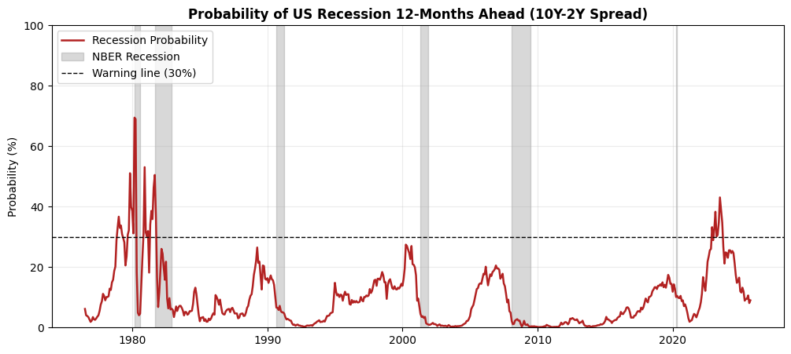
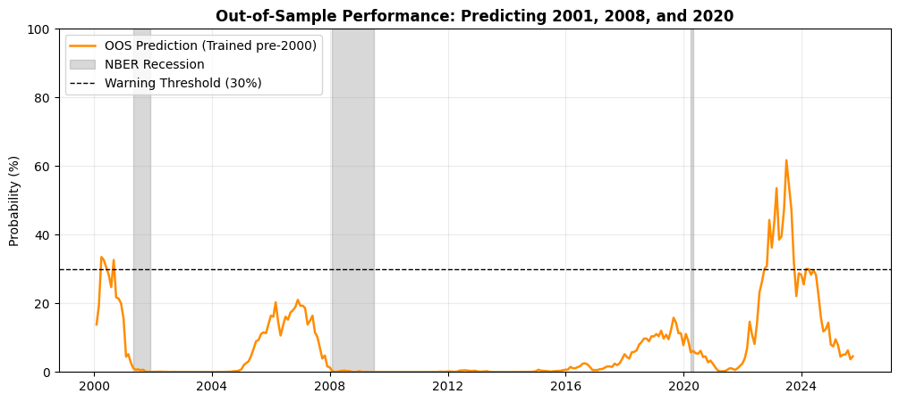

# US Recession Forecasting (12-Month Probit Model)

## Motivation

The New York Fed tracks recession risk using the framework introduced by Estrella & Mishkin (1998). I rebuilt their methodology from scratch to answer two practical questions:

1. **Why institutions use it:** See why a single 10Y-2Y spread is often preferred over complex multi-factor macro models for 12-month horizon forecasts.
2. **Stress-test the signal:** Test whether the historical warning threshold holds out-of-sample on modern cycles (2001, 2008, 2020, and 2022–2023) or if structural shifts have weakened the signal.
   
---

## Data & Methodology

* **Data Source:** Monthly series pulled directly from FRED (June 1976 – Present, ~590 observations).
* **Predictor ($X$):** 10-Year minus 2-Year Treasury spread (`DGS10` minus `DGS2`), sampled at month-end.
* **Target ($Y$):** NBER recession indicator (`USREC`), shifted 12 months ahead (`shift(-12)`). A spread observed at month $t$ strictly predicts whether the economy is in recession at $t+12$.

### Econometric Setup
Because the target is binary (0 or 1), an OLS regression would generate invalid probabilities outside $[0, 1]$. Instead, we estimate a standard binary Probit via Maximum Likelihood (MLE):

$$P(\text{USREC}_{t+12} = 1 \mid \text{Spread}_t) = \Phi(\beta_0 + \beta_1 \cdot \text{Spread}_t)$$

where $\Phi(\cdot)$ is the standard normal cumulative distribution function (CDF).

---

## Full Historical Fit (1976–Present)

Fitting the model across the full historical sample:
* **Spread coefficient ($\beta_1$):** `-0.7197` ($z = -6.97$, $p < 0.001$)
* **Constant ($\beta_0$):** `-0.9376` ($p < 0.001$)
* **Pseudo-R² (McFadden):** `0.165`

The statistically significant negative coefficient confirms that yield curve inversions systematically increase future recession odds.



*The dashed line marks the empirical **30% warning threshold** from Estrella & Mishkin (1998). Historically, crossing this line signaled an actionable recession risk within 12 months.*

---

## Out-of-Sample Validation (Post-2000 Cycles)

To test how the model behaves on unseen data without look-ahead bias, the sample is split chronologically:
* **Training set:** 1976–1999 (covering the 1980, 1981, and 1990 recessions).
* **Testing set:** 2000–Present (evaluated strictly on pre-2000 estimated coefficients).



### Diagnostics
* **ROC-AUC:** `0.727` (solid discriminative ranking for a single-variable baseline)
* **Brier Score:** `0.085` (strong probabilistic calibration against realized outcomes)

### Key Takeaways from the Out-of-Sample Test

Looking at the out-of-sample chart, the model tracks monetary cycles well, but reveals clear structural blind spots:

* **2001 (Dot-Com):** Worked as expected. The probability cleanly crossed 30% about a year before the recession started.
* **2008 (GFC):** Underestimated the crash. The probability rose to 21% (a clear warning vs. normal times), but missed the 30% trigger because the 2006 curve inversion was relatively shallow compared to the 1980s data the model trained on.
* **2020 (Covid):** Missed entirely (~15%). The yield curve flags economic overheating and rate hikes, not sudden external pandemic lockdowns.
* **2022–2023:** False alarm (>60%). The curve inverted violently, but a recession did not follow within 12 months—largely because pandemic savings, high government spending, and fixed-rate debt protected the economy.

**Bottom line:** The 10Y-2Y spread is a solid starting baseline for monetary cycle risk, but it cannot price in fiscal policy or sudden external shocks on its own.

---

## Current Diagnostic

* **Reference Period:** September 2026
* **10Y-2Y Spread:** +0.43%
* **12-Month Forward Probability:** **10.6%**
* **Reading:** The yield curve has normalized into positive territory. The forward recession risk sits well below the 30% warning threshold.

---

## How to Run

```bash
git clone https://github.com/ziem-branchereau/us-recession-probit-model.git
cd us-recession-probit-model
pip install -r requirements.txt
jupyter notebook recession_probit_model.ipynb
```

### Stack
`python`, `pandas`, `pandas_datareader`, `statsmodels`, `scikit-learn`, `matplotlib`

---

## References

* **Estrella, A., & Mishkin, F. S. (1998).** [*Predicting U.S. Recessions: Financial Variables as Leading Indicators*](https://www.newyorkfed.org/medialibrary/media/research/current_issues/ci2-7.pdf). *The Review of Economics and Statistics*, 80(1), 45–61.
* **Federal Reserve Bank of St. Louis (FRED):** 
  * [10-Year Treasury Constant Maturity Rate (`DGS10`)](https://fred.stlouisfed.org/series/DGS10)
  * [2-Year Treasury Constant Maturity Rate (`DGS2`)](https://fred.stlouisfed.org/series/DGS2)
  * [NBER based Recession Indicators for the United States (`USREC`)](https://fred.stlouisfed.org/series/USREC)
